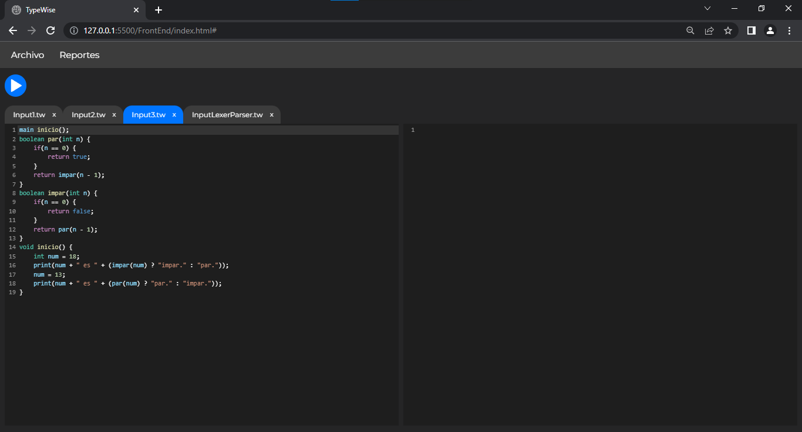

# TypeWise
## Manual de Usuario

## Índice

1. [Ejecutar Código](#1-ejecutar-código)
2. [Consola](#2-consola)
3. [Reporte De Errores](#3-reporte-de-errores)
4. [AST](#4-ast)
5. [Tabla De Símbolos](#5-tabla-de-símbolos)
6. [Sintaxis](#6-sintaxis)
7. [Sistema de Pestañas](#7-sistema-de-pestañas)

## 1. Ejecutar Código
* ### Para Ejecutar el código se debe hacer click en el botón de Play.



* ### Es posible tener más de un archivo abierto simultáneamente. [Ver Sistema de Pestañas](#7-sistema-de-pestañas).


[Subir](#typewise)

## 2. Consola
* ### En la consola es posible visualizar todo lo que reciba el argumento de la función nativa print.


* ### En caso de haber errores Léxicos o Sintácticos se mostrarán en consola.


[Subir](#typewise)

## 3. Reporte De Errores
* ### En caso de haber errores Léxicos o Sintácticos se puede generar un reporte y puede visualizarse seleccionando la opción correspondiente del menú Reportes.


[Subir](#typewise)

## 4. AST
* ### Al haber código en el editor se puede generar un reporte del AST y puede visualizarse seleccionando la opción correspondiente del menú Reportes.


[Subir](#typewise)

## 5. Tabla De Símbolos
* ### Al ejecutar el código escrito en el editor se puede visualizar un reporte de la Tabla de Símbolos seleccionando la opción correspondiente del menú Reportes.


[Subir](#typewise)

## 6. Sintaxis

* Declaración de Variables
```java
type id = value;
type [] id = value;
List<type> id = value;
```
* Declaración de Métodos y Funciones
```java
type id(type param1,type param2 ... type paramN) {
    //instrucciones
    return expresion;
}
void id(type param1,type param2 ... type paramN) {
    //instrucciones
}
type id() {
    //instrucciones
    return expresion;
}
void id() {
    //instrucciones
}
```
* Ciclos
```java
for(declarar o reasignar variable; condición; actualización de variable) {
    //instrucciones
}
while(condición) {
    //instrucciones
}
do {
    //instrucciones
}while(condición);
```
* Estructuras de Control
```java
//if else if                //if else                   //if
if(condicion) {             if(condicion) {             if(condicion) {
    //instrucciones             //instrucciones             //instrucciones
}                           }                           }
else if(condicion) {        else {
    //instrucciones             //instrucciones
}                           }
...
else {
    //instrucciones
}

//switch
switch(expresion) {
    case expresion:
        //instrucciones
    case expresion:
    case expresion:
    ...
    case expresion:
        //instrucciones
    default:
        //instrucciones
}
```
* Operador Ternario
```java
type id = condicion ? expresion : expresion;
```
* Casteo
```java
type id = (type) expresion;
```

[Subir](#typewise)

## 7. Sistema de Pestañas
* ### Mediante el Sistema de Pestañas es posible trasladarse entre proyectos del Lenguaje TypeWise.


* ### Es posible eliminar pestañas cuando ya no se requiera editar el código de algún proyecto.


[Subir](#typewise)