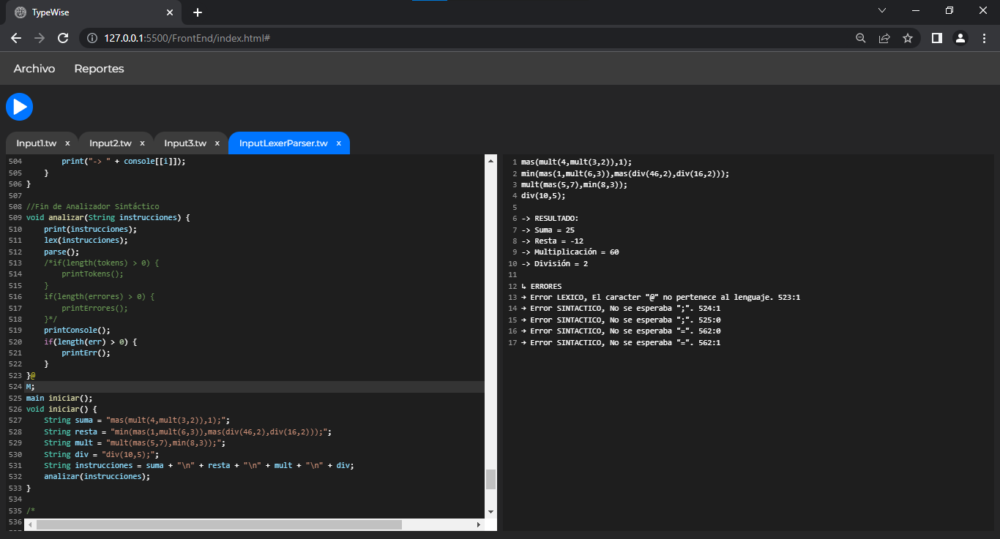
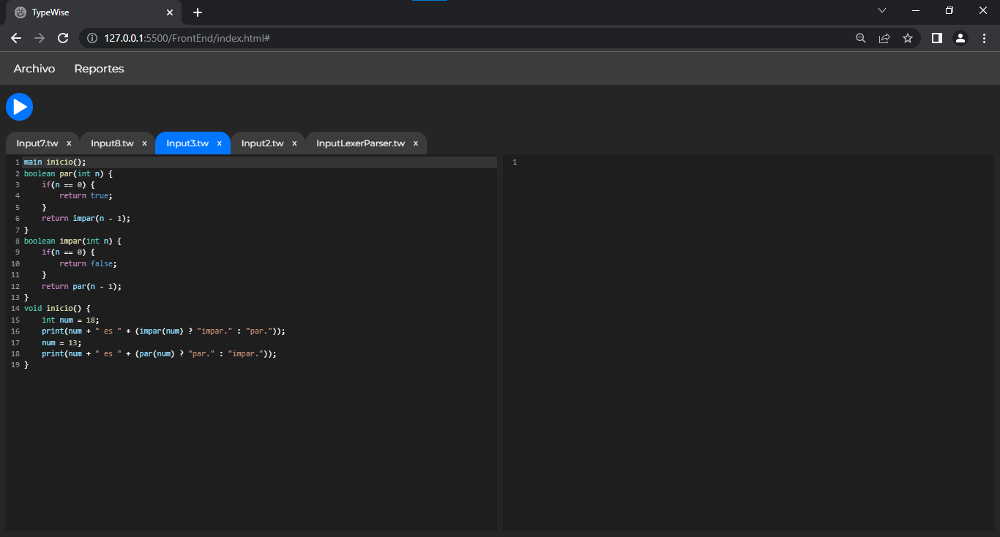
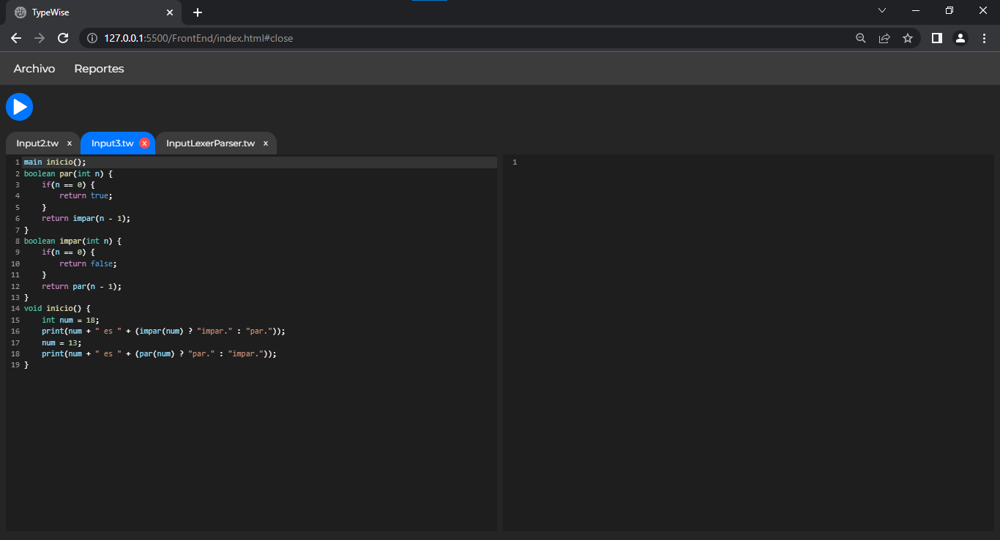

# Proyecto 2 OLC1 1S 2023

## 201908355 - Danny Hugo Bryan Tejaxún Pichiyá

## TypeWise

## Manual de Usuario

## Índice

1. [Ejecutar Código](#1-ejecutar-código)
2. [Consola](#2-consola)
3. [Reporte De Errores](#3-reporte-de-errores)
4. [AST](#4-ast)
5. [Tabla De Símbolos](#5-tabla-de-símbolos)
6. [Sintaxis](#6-sintaxis)
7. [Sistema de Pestañas](#7-sistema-de-pestañas)

## 1. Ejecutar Código
* ### Para Ejecutar el código se debe hacer click en el botón de Play.


* ### Es posible tener más de un archivo abierto simultáneamente. [Ver Sistema de Pestañas](#7-sistema-de-pestañas).


[Subir](#manual-de-usuario)

## 2. Consola
* ### En la consola es posible visualizar todo lo que reciba el argumento de la función nativa print.


* ### En caso de haber errores Léxicos o Sintácticos se mostrarán en consola.



[Subir](#manual-de-usuario)

## 3. Reporte De Errores
* ### En caso de haber errores Léxicos o Sintácticos se puede generar un reporte y puede visualizarse seleccionando la opción correspondiente del menú Reportes.


[Subir](#manual-de-usuario)

## 4. AST
* ### Al haber código en el editor se puede generar un reporte del AST y puede visualizarse seleccionando la opción correspondiente del menú Reportes.


[Subir](#manual-de-usuario)

## 5. Tabla De Símbolos
* ### Al ejecutar el código escrito en el editor se puede visualizar un reporte de la Tabla de Símbolos seleccionando la opción correspondiente del menú Reportes.


[Subir](#manual-de-usuario)

## 6. Sintaxis

* Declaración de Variables
```java
type id = value;
type [] id = value;
List<type> id = value;
```
* Declaración de Métodos y Funciones
```java
type id(type param1,type param2 ... type paramN) {
    //instrucciones
    return expresion;
}
void id(type param1,type param2 ... type paramN) {
    //instrucciones
}
type id() {
    //instrucciones
    return expresion;
}
void id() {
    //instrucciones
}
```
* Ciclos
```java
for(declarar o reasignar variable; condición; actualización de variable) {
    //instrucciones
}
while(condición) {
    //instrucciones
}
do {
    //instrucciones
}while(condición);
```
* Estructuras de Control
```java
//if else if                //if else                   //if
if(condicion) {             if(condicion) {             if(condicion) {
    //instrucciones             //instrucciones             //instrucciones
}                           }                           }
else if(condicion) {        else {
    //instrucciones             //instrucciones
}                           }
...
else {
    //instrucciones
}

//switch
switch(expresion) {
    case expresion:
        //instrucciones
    case expresion:
    case expresion:
    ...
    case expresion:
        //instrucciones
    default:
        //instrucciones
}
```
* Operador Ternario
```java
type id = condicion ? expresion : expresion;
```
* Casteo
```java
type id = (type) expresion;
```

[Subir](#manual-de-usuario)

## 7. Sistema de Pestañas
* ### Mediante el Sistema de Pestañas es posible trasladarse entre proyectos del Lenguaje TypeWise.



* ### Es posible eliminar pestañas cuando ya no se requiera editar el código de algún proyecto.



[Subir](#manual-de-usuario)

## TypeWise

## Manual Técnico

## Índice

1. [Análisis Léxico Y Sintáctico](#1-análisis-léxico-y-sintáctico)
2. [Tipos De Datos](#2-tipos-de-datos)
    1. [Tipo Dominante En Operaciones Aritméticas](#2.1-tipo-dominante-en-operaciones-aritméticas)
    2. [Tipos De Retorno](#2.2-tipos-de-retorno)
3. [Clases Abstractas](#3-clases-abstractas)
4. [Entornos](#4-entornos)

## 1. Análisis Léxico Y Sintáctico
* [Ver Expresiones Regulares y Gramática](./Gramatica.md)

## 2. Tipos De Datos
```ts
export enum Type {
    INT,
    DOUBLE,
    BOOLEAN,
    CHAR,
    STRING,
    ARRAY,
    LIST,
    NULL
}
```
[Subir](#manual-técnico)


## 2.1. Tipo Dominante En Operaciones Aritméticas
### 2.1.1. Suma
|    +    |  INT   | DOUBLE | BOOLEAN | CHAR   | STRING |
|    -    |   -    |   -    |    -    |   -    |   -    |
| INT     | INT    | DOUBLE | INT     | INT    | STRING |
| DOUBLE  | DOUBLE | DOUBLE | DOUBLE  | DOUBLE | STRING |
| BOOLEAN | INT    | DOUBLE | NULL    | NULL   | STRING |
| CHAR    | INT    | DOUBLE | NULL    | STRING | STRING |
| STRING  | STRING | STRING | STRING  | STRING | STRING |

[Subir](#manual-técnico)

### 2.1.2. Resta
|    -    | INT    | DOUBLE | BOOLEAN | CHAR   | STRING |
|    -    |   -    |   -    |    -    |   -    |   -    |
| INT     | INT    | DOUBLE | INT     | INT    | NULL   |
| DOUBLE  | DOUBLE | DOUBLE | DOUBLE  | DOUBLE | NULL   |
| BOOLEAN | INT    | DOUBLE | NULL    | NULL   | NULL   |
| CHAR    | INT    | DOUBLE | NULL    | NULL   | NULL   |
| STRING  | NULL   | NULL   | NULL    | NULL   | NULL   |

[Subir](#manual-técnico)

### 2.1.3. Multiplicación
|    *    | INT    | DOUBLE | BOOLEAN | CHAR   | STRING |
|    -    |   -    |   -    |    -    |   -    |   -    |
| INT     | INT    | DOUBLE | NULL    | INT    | NULL   |
| DOUBLE  | DOUBLE | DOUBLE | NULL    | DOUBLE | NULL   |
| BOOLEAN | NULL   | NULL   | NULL    | NULL   | NULL   |
| CHAR    | INT    | DOUBLE | NULL    | NULL   | NULL   |
| STRING  | NULL   | NULL   | NULL    | NULL   | NULL   |

[Subir](#manual-técnico)

### 2.1.4. División
|    /    | INT    | DOUBLE | BOOLEAN | CHAR   | STRING |
|    -    |   -    |   -    |    -    |   -    |   -    |
| INT     | DOUBLE | DOUBLE | NULL    | DOUBLE | NULL   |
| DOUBLE  | DOUBLE | DOUBLE | NULL    | DOUBLE | NULL   |
| BOOLEAN | NULL   | NULL   | NULL    | NULL   | NULL   |
| CHAR    | DOUBLE | DOUBLE | NULL    | NULL   | NULL   |
| STRING  | NULL   | NULL   | NULL    | NULL   | NULL   |

[Subir](#manual-técnico)

### 2.1.5. Potencia
|    ^    | INT    | DOUBLE | BOOLEAN | CHAR   | STRING |
|    -    |   -    |   -    |    -    |   -    |   -    |
| INT     | INT    | DOUBLE | NULL    | NULL   | NULL   |
| DOUBLE  | DOUBLE | DOUBLE | NULL    | NULL   | NULL   |
| BOOLEAN | NULL   | NULL   | NULL    | NULL   | NULL   |
| CHAR    | NULL   | NULL   | NULL    | NULL   | NULL   |
| STRING  | NULL   | NULL   | NULL    | NULL   | NULL   |

[Subir](#manual-técnico)

### 2.1.6. Módulo
|    %    | INT    | DOUBLE | BOOLEAN | CHAR   | STRING |
|    -    |   -    |   -    |    -    |   -    |   -    |
| INT     | DOUBLE | DOUBLE | NULL    | NULL   | NULL   |
| DOUBLE  | DOUBLE | DOUBLE | NULL    | NULL   | NULL   |
| BOOLEAN | NULL   | NULL   | NULL    | NULL   | NULL   |
| CHAR    | NULL   | NULL   | NULL    | NULL   | NULL   |
| STRING  | NULL   | NULL   | NULL    | NULL   | NULL   |

[Subir](#manual-técnico)

## 2.2. Tipos De Retorno
Es el tipo que retorna cada Expresión para tener referencia, no solo del valor sino también del tipo de dato resultante.
```ts
export type ReturnType = {value: any,type: Type}
```
[Subir](#manual-técnico)

## 3. Clases Abstractas

## 3.1. Expresión
* Se implementó la clase Expression que es la clase padre de todas aquellas funcionalidades del lenguaje TypeWise que retornan un valor, tales como:
 
    * Llamada a Función
    * Acceso a Variables
        - Primitivas
        - Posiciones de Arreglos
        - Posiciones de Listas
    * Sentencia 'Return'
    * Operaciones
        - Aritméticas
        - Relacionales
        - Lógicas
    * Funciones Nativas
        - To Lower
        - To Upper
        - Length
        - Truncate
        - Round
        - Type Of
        - To Char Array
    * Operador Ternario
    * Casteo
    * Incremento
    * Decremento

Es necesario que cada expresión tenga una referencia de los entornos globales relativamente, ya que desde un bloque de código interno se puede acceder a las variables y funciones de los entornos más globales.

```typescript
export abstract class Expression {
    constructor(public line: number,public column: number,public type: Type,public typeExp: TypeExp) {}
    public abstract execute(env: Environment): ReturnType;
}
```
[Subir](#manual-técnico)

## 3.2. Instrucción
* Se implementó la clase Instruction que es la clase padre de todas aquellas funcionalidades del lenguaje TypeWise que no retornan un valor, tales como:
    * Función Add propia de Listas
    * Inicialización de Variables
        - Primitivas
        - Arreglos
        - Listas
    * Sentencias de Transferencia
        - Continue
        - Break
    * Reasignación de Valores
        - Variables Primitivas
        - Posiciones de Arreglos
        - Posiciones de Listas
    * Declaración de Funciones
    * Estructuras de Control
        - If
        - Else If
        - Else
        - Switch Case
        - Ciclos
            * For
            * While
            * Do While
    * Bloques de Instrucciones

Es necesario que cada instrucción tenga una referencia de los entornos globales relativamente, ya que desde un bloque de código interno se puede acceder a las variables y funciones de los entornos más globales.

```typescript
export abstract class Instruction {
    constructor(public line: number,public column: number,public typeInst: TypeInst) {}
    public abstract execute(env: Environment): any;
}
```
[Subir](#manual-técnico)

## 4. Entornos
En el entorno se guarda la referencia hacia cada variable, arreglo, método o función declarada.
* Para declarar una variable nueva primero se debe verificar que no exista previamente, en el Map de identificadores del entorno, una variable con el mismo nombre sin importar el tipo.
```ts
public saveID(id: string,value: any,type: Type,line: number,column: number) {
    let env: Environment = this
    if(!env.ids.has(id.toLowerCase())) {
        env.ids.set(id.toLowerCase(),new Symbol(value,id,type,undefined))
        symbolTable.push(new TabSym(line,column,id.toLowerCase(),'Variable',this.getTypeOf(type),env.name))
    }
    else {
        printList.push(`Error, La variable "${id}" ya existe en el entorno, linea ${line} columna ${column}.`)
    }
}
```
[Subir](#manual-técnico)

* Para declarar un arreglo nueva primero se debe verificar que no exista o esté declarada previamente, en el Map de identificadores del entorno, una variable con el mismo nombre sin importar el tipo.
```ts
public saveArray(id: string,value: any,type: Type,line: number,column: number) {
    let env: Environment = this
    if(!env.ids.has(id.toLowerCase())) {
        env.ids.set(id.toLowerCase(),new Symbol(value,id,Type.ARRAY,type))
        symbolTable.push(new TabSym(line,column,id.toLowerCase(),'Variable',`Array ${this.getTypeOf(type)}`,env.name))
    }
    else {
        printList.push(`Error, El vector "${id}" ya existe en el entorno, linea ${line} columna ${column}.`)
    }
}
```
[Subir](#manual-técnico)

* Para declarar una lista nueva primero se debe verificar que no exista o esté declarada previamente, en el Map de identificadores del entorno, una variable con el mismo nombre sin importar el tipo.
```ts
public saveList(id: string,value: any,type: Type,line: number,column: number) {
    let env: Environment = this
    if(!env.ids.has(id.toLowerCase())) {
        env.ids.set(id.toLowerCase(),new Symbol(value,id,Type.LIST,type))
        symbolTable.push(new TabSym(line,column,id.toLowerCase(),'Variable',`List ${this.getTypeOf(type)}`,env.name))
    }
    else {
        printList.push(`Error, La lista "${id}" ya existe en el entorno, linea ${line} columna ${column}.`)
    }
}
```
[Subir](#manual-técnico)

* Para obtener el valor de una variable es necesario hacer una búsqueda en el Map de identificadores de cada entorno comenzando por el entorno local. En caso de no encontrar el identificador en el entorno local es necesario ascender de entornos hasta encontrar el identificador de la variable, si es que se declaró previamente.
```ts
public getValue(id: string): Symbol | null {
    let env: Environment | null = this
    while(env) {
        if(env.ids.has(id.toLowerCase())) {
            return env.ids.get(id.toLowerCase())!
        }
        env = env.previous
    }
    return null
}
```
[Subir](#manual-técnico)

* Para obtener el valor de una posición de un arreglo o lista es necesario hacer una búsqueda en el Map de identificadores de cada entorno comenzando por el entorno local. En caso de no encontrar el identificador en el entorno local es necesario ascender de entornos hasta encontrar el identificador de la variable, si es que se declaró previamente. Si existe se utiliza el índice que fue enviado como parámetro para encontrar una posición específica del arreglo o lista.
```ts
public getValueArrayList(id: string,index: number): Symbol | null {
    let env: Environment | null = this
    while(env) {
        if(env.ids.has(id.toLowerCase())) {
            let symbol: Symbol = env.ids.get(id.toLowerCase())!
            return symbol.value[index]
        }
        env = env.previous
    }
    return null
}
```
[Subir](#manual-técnico)

* Para reasignar un nuevo valor a una variable previamente declarada es necesario hacer una búsqueda en el Map de identificadores de cada entorno comenzando por el entorno local. En caso de no encontrar el identificador en el entorno local es necesario ascender de entornos hasta encontrar el identificador de la variable, si es que se declaró previamente. Si existe se le asigna el nuevo valor
```ts
public reasignID(id: string,value: ReturnType): boolean {
    let env: Environment | null = this
    while(env) {
        if(env.ids.has(id.toLowerCase())) {
            let symbol: Symbol = env.ids.get(id.toLowerCase())!
            symbol.value = value.value
            env.ids.set(id.toLowerCase(),symbol)
            return true
        }
        env = env.previous
    }
    printList.push(`Error, La variable "${id}" no ha sido declarada.`)
    return false
}
```
[Subir](#manual-técnico)

* Para reasignar un nuevo valor a una posición de un arreglo o lista es necesario hacer una búsqueda en el Map de identificadores de cada entorno comenzando por el entorno local. En caso de no encontrar el identificador en el entorno local es necesario ascender de entornos hasta encontrar el identificador de la variable, si es que se declaró previamente. Si existe se utiliza el índice que fue enviado como parámetro para encontrar una posición específica del arreglo o lista y reasignarle el nuevo valor.
```ts
public reasignArrayList(id: string,index: number,value: Primitive): boolean {
    let env: Environment | null = this
    while(env) {
        if(env.ids.has(id.toLowerCase())) {
            let symbol: Symbol = env.ids.get(id.toLowerCase())!
            symbol.value[index] = value
            env.ids.set(id.toLowerCase(),symbol)
            return true
        }
        env = env.previous
    }
    printList.push(`Error, La variable "${id}" no ha sido declarada.`)
    return false
}
```
[Subir](#manual-técnico)

* Para insertar un nuevo valor en una lista es necesario hacer una búsqueda en el Map de identificadores de cada entorno comenzando por el entorno local. En caso de no encontrar el identificador en el entorno local es necesario ascender de entornos hasta encontrar el identificador de la variable, si es que se declaró previamente. Si existe se inserta el nuevo valor a la lista.
```ts
public addList(id: string,value: Primitive): boolean {
    let env: Environment | null = this
    while(env) {
        if(env.ids.has(id.toLowerCase())) {
            let symbol: Symbol = env.ids.get(id.toLowerCase())!
            symbol.value.push(value)
            env.ids.set(id.toLowerCase(),symbol)
            return true
        }
        env = env.previous
    }
    printList.push(`Error, La variable "${id}" no ha sido declarada.`)
    return false
}
```
[Subir](#manual-técnico)

* Para declarar una función o método nueva primero se debe hacer una búsqueda en el Map de funciones del entorno global. En caso de no encontrar el identificador de la función en el entorno global se guarda la nueva función.
```ts
public saveFunction(id: string,func: Function) {
    let env: Environment = this
    if(!env.functions.has(id.toLowerCase())) {
        env.functions.set(id.toLowerCase(),func)
        let typeFunc: string = this.getTypeOfFunc(func.type)
        symbolTable.push(new TabSym(func.line,func.column,id.toLowerCase(),typeFunc == 'void' ? 'Método' : 'Función',typeFunc,env.name))
    }
    else {
        printList.push(`Error, La función ${id} ya existe en el entorno`)
    }
}
```
[Subir](#manual-técnico)

* Para obtener una función o método, para posteriormente ejecutarla, primero se debe hacer una búsqueda en el Map de funciones del entorno global. En caso de no encontrar el identificador de la función en el entorno global no se retorna nada.
```ts
public getFunction(id: string): Function | null {
    let env: Environment | null = this
    while(env) {
        if(env.functions.has(id.toLowerCase())) {
            return env.functions.get(id.toLowerCase())!
        }
        env = env.previous
    }
    return null
}
```
[Subir](#manual-técnico)

* Para obtener el entorno global es necesario ir ascendiendo desde el entorno local actual hasta que ya no exista un entorno global relativo del entorno actual.
```ts
public getGlobal(): Environment {
    let env: Environment | null = this
    while(env.previous) {
        env = env.previous
    }
    return env
} 
```
[Subir](#manual-técnico)